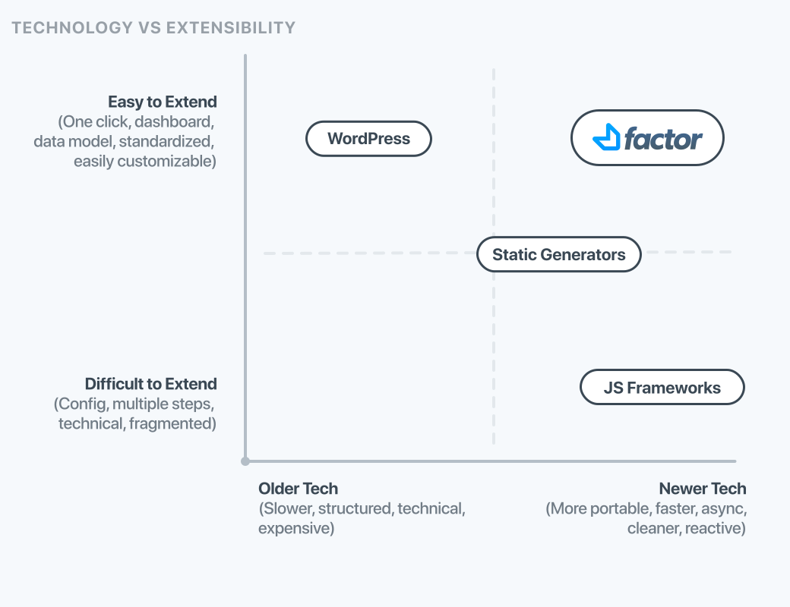
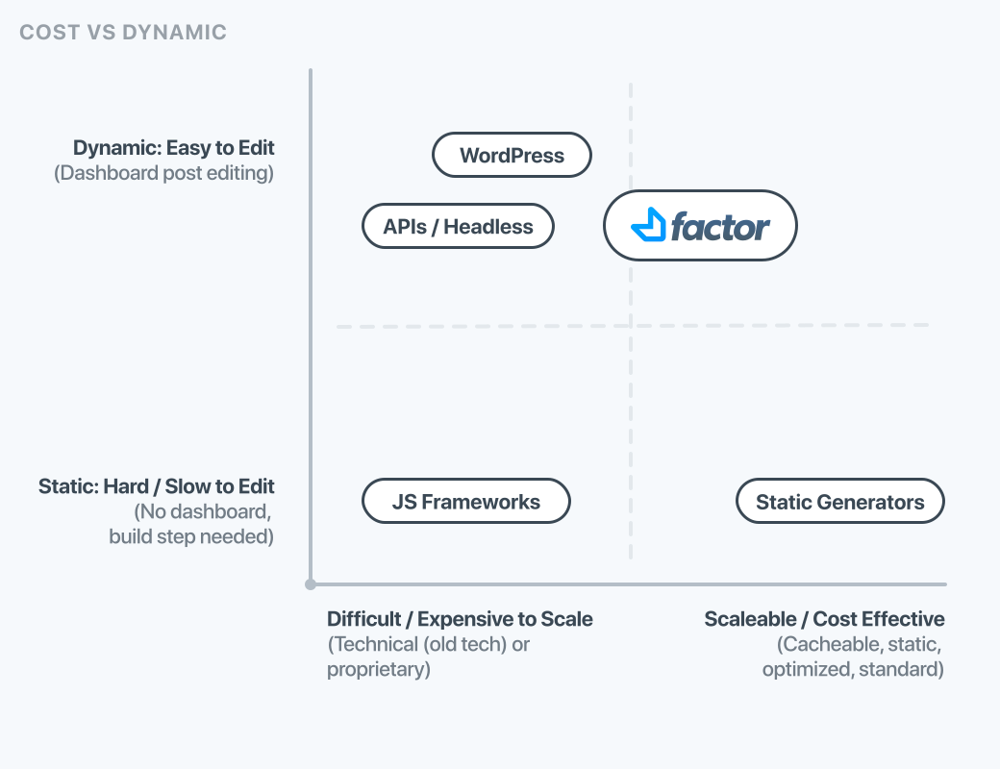

# Comparing Factor

## Overview

There are hundreds of technologies to consider when building a web app and there are specific use cases where Factor is better suited than others.

In this doc, we'll discuss some of the various development approaches and their advantages and disadvantages compared to Factor.

## Front-End Developers

Is Factor for you? As discussed in the [Factor Introduction](./), Factor is designed with the needs of **front-end developers** in mind.

Specifically, if you are a developer:

1. Looking to build a web app or website using JavaScript
2. The app needs to include dynamic functionality like sending email, auth, forms, users, ssr, etc..

then likely, Factor is a great choice.

As front-end developers ourselves, we built Factor with the following general philosophy:

### Goals

- **Extension First:** Useful, easy to work with plugin and theme systems
- **Elegant** Full-Stack JavaScript built on open-source tech. Minimize proprietary APIs and lock in.
- **Minimalist:** Measured and minimal core features. Everything has it's purpose.

### Non-Goals

- **No "magic"** - Things should not just happen without having to explicitly define the functionality. For example, routes should not auto generate. Magic creates bloat (as you modify and customize) and mysterious bugs.
- **Avoid "No Code" Concepts (builders or drag-and-drop)** - The concept of "no coding" is usually not what front-end developers want. They'd rather build things to a "standard" as opposed to learning proprietary drag and drop tools. (Note that extensions could easily provide this functionality.)

## Who should NOT choose Factor

Factor is built for front-end developers who don't mind coding, but just want to deal with the "fun parts" of coding (not technical docs or debugging!).

Factor isn't for non-technical folks, (although it is easy for a Factor developer to create something that is).

## Comparisons

### Comparison Charts

There are always tradeoffs in the development world. Let's discuss a few of the common ones...

#### Latest Tech and Extension Power

WordPress has a powerful extension system that is very mature and easy to use. Factor used this system as inspiration in developing it's own.

However, Factor leverages all the benefits of the latest technology. Like portability, speed, async, etc..

#### Dynamic vs Static

There is a tradeoff between "dynamic" and "static" frameworks. The ultimate right answer here usually just comes down to what you need to do.

- Need a basic documentation site or marketing portal? Use a static framework.
- Want a fully featured app that includes auth, CMS, etc.. ? Use a dynamic framework.

Dynamic features require an active server and this inherently requires a bit more resources to scale when compared to static files that are generated and then simply served.

Factor's strength and focus is on dynamic apps, although it is possible to use it as a static generator with a plugin.

### WordPress

**Advantages**

- Mature ecosystem
- 10000+ Plugins and Themes

**Disadvantages**

- Old technology stack (harder to develop with and scale)
- Slower performance
- Built for blogging as opposed to websites or apps

### JS Frameworks

**Advantages**

- Minimal structure
- Less "opinionated"

**Disadvantages**

- Difficult to extend
- Time spent reinventing the wheel
- More debugging time
- More code to manage

### JAMStack / Static Generators

**Advantages**

- Lowest cost to host (however, more expensive if using 3rd party APIs)
- No backend to manage
- Minimal server tech needed

**Disadvantages**

- Confusing and tedious "build and rebuild" editing
- No dynamic features like auth, endpoints etc.. without 3rd party tools (which mean cost + lock-in)

### Headless CMS

**Advantages**

- Managed and intuitive content editing through service
- No backend to manage for basic content

**Disadvantages**

- Maximized Lock-in
- Still need to build app
- More expensive to scale
- Complicated API spaghetti
- Non-standard tech
- No point if you need more than basic CMS

### Builders and No-Code Tools

**Advantages**

- Non-technical
- No code or backend

**Disadvantages**

- Maximized Lock-in
- Expensive to scale
- Inefficient to manage (non-standard tech)
- Basic functionality with additional lock-in, complication and costs as you add functionality via plugins, etc.
