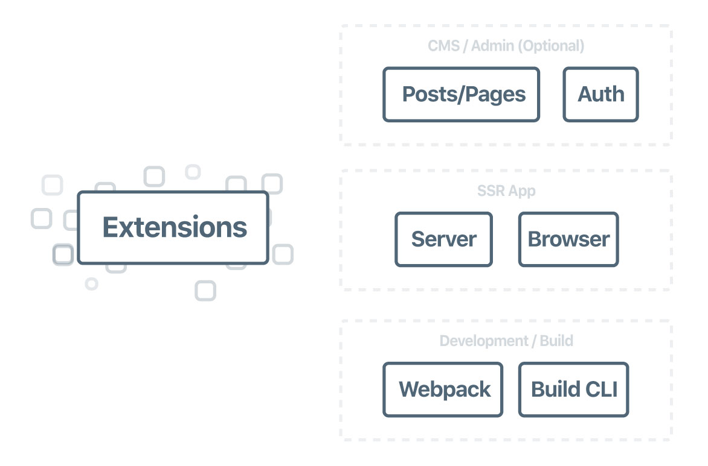

# Introduction
 
## [What is Factor?](#what-is-factor)
> Factor is a web application operating system (webOS) used to create server rendered Javascript apps. It is built on top of NodeJS and VueJS and designed from the ground up for extension and content management.  

**Why Factor?** &mdash; 

Most developers primary goal is to ship production apps. However, today the JS world has many pitfalls that lead to painful rewrites, complications or lock-in; and this inevitably results in delays, wasted time and money. 

We faced this problem, and worked years to create a decent app architecture to avoid these problems. After many writes and rewrites this is what resulted in Factor.

We believe that many modern devs are facing similar issues and so we've open-sourced it in the hopes that it may be useful to you. 

Use Factor if you want to: 
- Avoid writing code that has been written countless times already
- Minimize lock-in with services
- Give your apps a rich CMS architecture to support common tasks
- Use best practices

## [How it Works](#how-it-works)

You can think of Factor as a system that brings together the following:

- A Core Node/VueJS Framework
- An Drop-In Extensions System
- Build System and CLI for managing your app

#### [Features](#features)

- Dashboard and Page/Post Management System (optional)
  - Similar to WordPress' admin
  - User management / Authentication
  - Real time site editing (no builds and rebuilds)
- Comprehensive VueJS/NodeJS framework
  - Server-side-rendered (SSR) for Performance and SEO
  - Reactive 
  - Routes(vue-router), Stores(vuex), CLI, Builds
- Extensions System
  - Themes system for quickly creating beautiful apps
  - Stacks system for avoiding service learning curve and lock-in

## [Concepts](#concepts)

### [Framework](#build)

Factor, at its heart, is a system that coordinates different developer tools and environments to create a consistent and simple development experience. 

The purpose of the this is to abstract away all the configuration, bundling, file generation, etc.. so you can focus on **just building your app.**

Parts of the build system include: 
- CLI (Node)
- Local development server
- Webpack bundling system
- Extension and filter system

While in reality you'll be working across environments (cli, node, cloud, app(client/server)), the build system orchestrates this and makes it feel like a common VueJS/Javascript app.

### [CMS: Dashboard and Posts System](#cms)

Similar to WordPress, a core effort of Factor optionally includes a set of common patterns that almost every web app needs and benefits from, which we call the **Factor CMS**. These include: 

- User Dashboard
- Posts and Post Management (in Factor, and similar to WordPress, everything is a post - pages, users, docs, etc... )
- Admin Dashboard 
- Authentication
- Basic Data and Image Storage

These features are optional and extension based. They build on top of Factor's core framework and build system.

### [Stack Extensions](#stacks)

Stacks solve problems when working with various service APIs. 
- Lock-In &mdash; Almost every service you use attempts to lock you into their service by encouraging the co-mingling your app with their custom features and APIs. 
- Exponential Learning Curve &mdash; Every service has a different API and approach. Some good and some bad. As you add more and more APIs this problem gets worse as you have more to remember.
- Cost and Wasted Time &mdash; Comparing and shopping for services is a massive time suck. Then once you choose a service you have to optimize it or pay.

Stacks are like themes, but for services. They compartmentalize and orchestrate service specific code into one place and create an interface for them to interact with your app. 

[Learn more about stacks](./stacks)

### [Themes](#themes)

In many platforms, Themes are critical in developing apps. However, theming is typically neglected in JS frameworks. With Factor this isn't the case. 

The scope of a Factor theme is to give you an advanced starting point for your app and it can save you a ton of time. Themes add or include extensions of their own, and include useful templates and UI tools.

The theme structure is the same as your application structure. This means you can use a theme as starting point or you can inherit from it by adding it in your factor-config file and as a dependency. Inheriting has the added benefit of the theme being 'updateable' which is not possible once you've edited it. 

[Learn more about themes](./themes)
 
## Ready For More?

We’ve briefly introduced the most basic features of Factor - the rest of this guide will cover them and other advanced features with much finer details, so let's dig in.