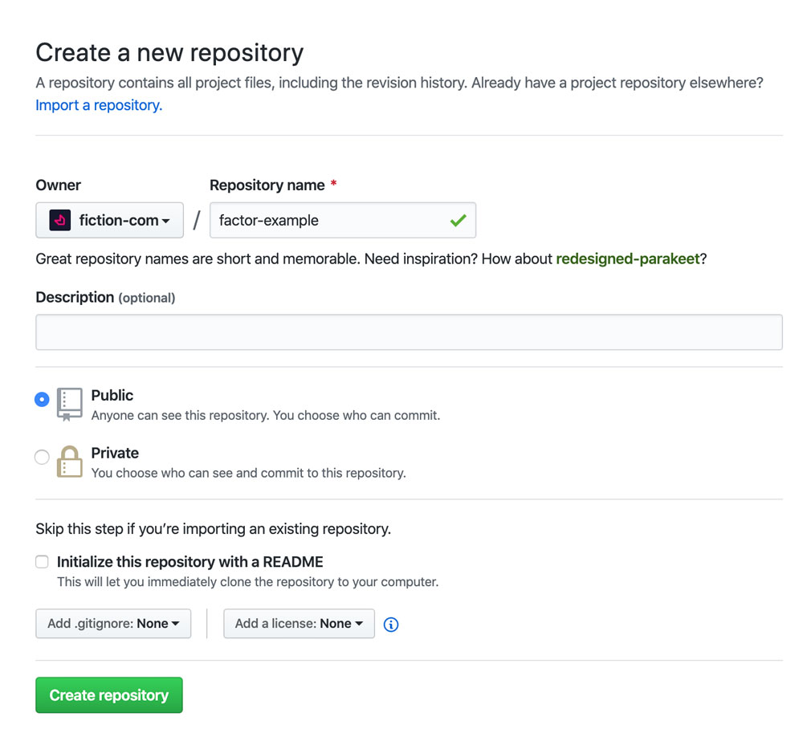

# Basic Example

Let's dig in to the basics of developing an application with Factor.

Full stacks apps have many functional aspects, but the good news is Factor standardizes them for you.

In this document, we'll create a basic, yet fully featured full-stack Factor app from scratch.

## 1. Create A Repo

Let's start by creating a repository to hold our code. Go to [Github](https://github.com/) and create a new repository and clone it to wherever you keep projects on your computer. In this example, we'll call our project "factor-example."



```bash
cd projects
git clone https://github.com/your-organization/factor-example.git
cd ./factor-example
```

## 2. Add Package.json

Next we'll create a standard [package.json](https://docs.npmjs.com/files/package.json) file. Here we'll add just a few fields:

```json
{
  "name": "factor-example",
  "description": "A basic application built with Factor JS",
  "license": "UNLICENSED",
  "version": "1.0.0",
  "factor": {
    "target": {
      "app": "index",
      "server": "server"
    },
    "url": "https://basic-example.factor.dev"
  },
  "dependencies": {
    "@factor/core": "^1.0.0"
  }
}
```

## 3. Add Main Files: index.js and server.js

Next we'll add two "main" files. Main files serve as the entry point to the application and can be used to add custom behavior.

The "target" attribute in package.json specifies that `server.js` will load in the "server" environment and `index.js` will load in the app environment. So simply add those files and we'll add some code to them later.

## 3. Install Dependencies

You'll want to make sure you have [Yarn](https://yarnpkg.com/lang/en/) installed, and once you do, just run `yarn install` in the root of your project. This will install Factor and all its core dependencies.

```bash
yarn install
```

## 4. Add .gitignore

Next we'll add a basic `.gitignore` file to make sure Git doesn't think we want to commit `node_modules` to our repo. We'll also add a few other ignored items that we won't want to commit.

```git
# Factor
dist
.factor

# Private Keys
.env

# Modules
node_modules

# Other
*.log
.DS_store
```

## 5. content.vue

Next we'll add the `content.vue` content wrapper component. This is the parent component for all front-end pages in our app. It can be used to add globally available UI like a header and footer.

```html
<template>
  <div class="content">
    <router-view />
  </div>
</template>
```

## 6. Add Routes and View Components

Next we'll add our first two routes along with the components that will be shown on them.

First, add two Vue components: `v-home.vue` and `v-page.vue`. And set up the basic information needed for a Vue.

```html
<template>
  <div class="home-page">
    This is my home page.
  </div>
</template>
```

```html
<template>
  <div class="another-page">
    This is another page.
  </div>
</template>
```

In your `index.js` add the following code:

```js
import { addContentRoute } from "@factor/tools"

addContentRoute({
  path: "/",
  component: () => import("./v-home.vue")
})

addContentRoute({
  path: "/page",
  component: () => import("./v-page.vue")
})
```

## 7. Run The CLI

Now it's time to run the Factor CLI and see if our application is working. Open up your terminal and type `yarn factor dev`. You should see the CLI build and then run the dev server for your application.

Once built, open up [localhost:3000](https://localhost:3000) and you should see "This is my home page." Congratulations! Our basic app is running.

## 8. Other Components

Now that we have our basic app, let's add a couple more components. Hopefully, If you're familiar with Vue, then once we add a few basic items things should feel very familiar.

Add `header.vue` and `splash.vue`

```html
<template>
  <div class="app-header">
    <factor-link path="/">Home</factor-link>
    <factor-link path="/page">Page</factor-link>
  </div>
</template>
<script>
  import { factorLink } from "@factor/ui"
  export default {
    components: {
      factorLink
    }
  }
</script>
```

```html
<template>
  <div class="splash">
    <h1>{{text}}</h1>
  </div>
</template>
<script>
  export default {
    props: {
      text: { type: String, default: "" }
    }
  }
</script>
```

Working on these components is just typical [Vue development](https://vuejs.org/). Now that you've created these components, import and add the `header` component to the `content.vue` wrapper. Import the splash component in each of your components. Look at the [example application](https://github.com/fiction-com/factor-example) on Github to see how I did it.

At this point you should be able to visit the site at [localhost:3000](https://localhost:3000) and click between the two routes that we've setup. Great work.

## 9. Setup Dashboard and DB

The next step is to setup dynamic functionality which includes your dashboard, users, endpoints and more.

You'll need to add a `.env` file to your project and follow the guide here: [dashboard setup](./dashboard-setup).
