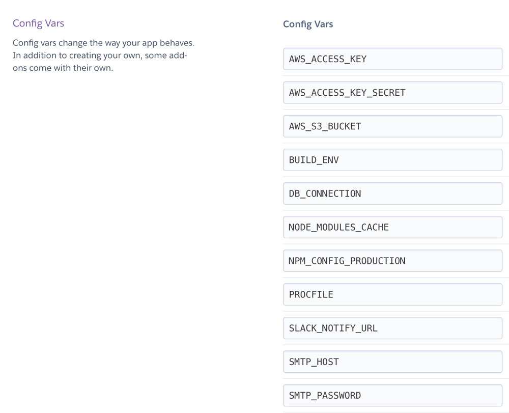

# Deploying Your App

Now that you've built your app, you'll be happy to learn that deploying it to production is easy.

In fact, what you are doing with your local server is exactly the same as what you will run in your "live" server environment.

## 1. Choose A Host

You'll first need to get a server that is running Node 10 or greater. We recommend [Heroku](https://heroku.com) or similar.

## 2. Setup Environment

Next set up your environmental variables at your host. These should be the production versions of the variables you have in your local `.env` file.

## 3. Build `/dist` and Deploy to Server

Now you need to build your application and deploy this code to your host. With Heroku, this is done using the [heroku-postbuild](https://devcenter.heroku.com/articles/nodejs-support#customizing-the-build-process) script, but there are many ways to build an application.

All that is needed to build your production application is to run `yarn factor build` inside your app.

## 4. Start Your Server

Now that you've got your built application on your server, all that is left is to run `yarn factor serve`.

This will start your express server and run the bundles it finds in the `dist` folder.

With Heroku, this is accomplished using their `Procfile` standard, which is a simple script that runs whenever a deployment finishes.
