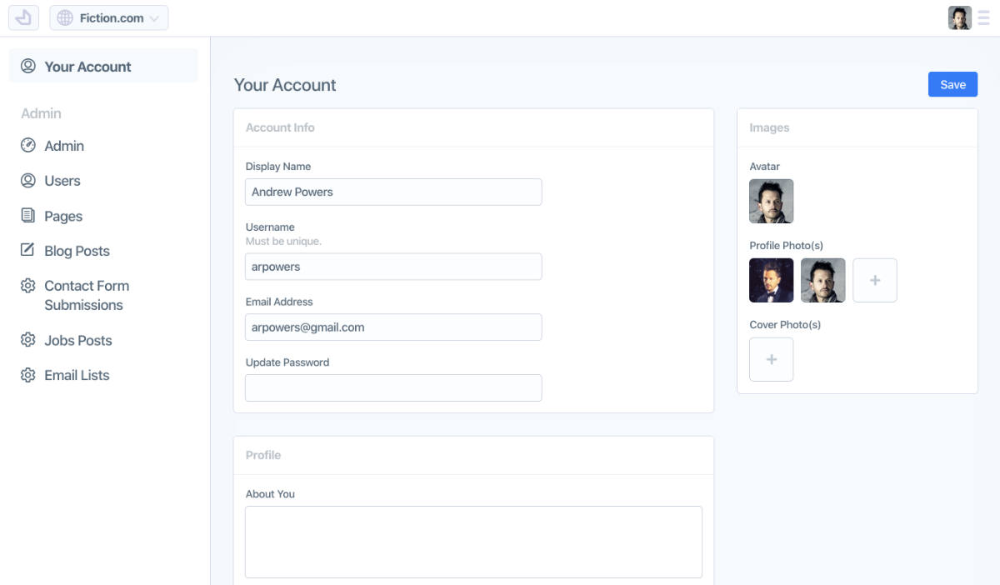

# Dashboard Setup

Ready to setup your dashboard? These features allow extension developers to create CMS oriented tools that are dynamic, consistent, and easy to manage.


## Before You Start

To use the dashboard all you need is a [MongoDB connection string](https://docs.mongodb.com/manual/reference/connection-string/), which gives us a place to save data, do auth, etc.

From there, different plugins may require different config information. E.g. AWS credentials. So you may need to have those handy as well.

## Connect Your DB

The only detail needed to run your dashboard is a MongoDB/Mongoose compatible DB connection string. If you are not familiar with this, a service like [Mongo Atlas](https://www.mongodb.com/cloud/atlas) and they will walk you through the steps needed.

Once you have your connection string, just add it in your `.env` file under the variable `DB_CONNECTION`.

```git
# .env - DB Connection (Mongo Connection String)
DB_CONNECTION="mongodb://db1.example.net:27017,db2.example.net:2500/?replicaSet=test"
```

> For help with setup: run `yarn factor setup`

## Add An Admin User

### Setting Up Your Token Key

Json Web Tokens (JWTs) are a simple and effective way of managing user authentication.

All that is needed to make JWTs work is a "token secret" used for encoding them on your server. To add it:

```git
# .env - Token Secret: Treat like a password, can be whatever you want
TOKEN_SECRET="SOME-LONG-TEXT-12345"
```

### Assigning Roles

Factor includes a user role system controlled via your `factor-settings.js` file.

To add your first admin users, just add the email of the user you'd like to assign a role along with the role.

```json
// factor-settings.js
{
  "config": {
    "roles": {
      "admin@email.com": "admin",
      "moderator@email.com": "moderator",
      "author@email.com": "author"
    }
  }
}

// Available roles
{
  "admin": 500,
  "moderator": 400,
  "author": 100,
  "member": 1,
  "visitor": 0
}

```

**Notes:**

- User account's email addresses must be successfully verified in order for admin privileges to be applied.
- Available roles are

## Verifying Email and Logging In

Once configured, visit [localhost:3000/dashboard](http://localhost:3000/dashboard) and you should be asked to "login" or "sign-up." Just hit "sign-up", create an account and then you should be able to see your dashboard.

Inside the dashboard, on your 'account' page, you'll find a button to send yourself a verification email. Visit the link that was sent to verify your email.

Notes:

- If you haven't set up transactional email yet, then the output of the verification email will be logged to your console.
- It is also possible to verify your email manually by accessing your database and finding the user associated with your account (set `emailVerified: true`)



## Success and Next Steps

At this point you should be setup with everything you need to work with your app's dashboard.

The next step is to configure other common services that your app will need. For example, your image storage and email SMTP services. Read on for a quick overview on how those are configured.

### Transactional Email

Factor includes a standard email interface for transactional email sent with SMTP.

To set this up, you'll need the following standard SMTP config. (Add to `.env` file and run `factor setup` for help)

```git
# .env - SMTP connection info
SMTP_USERNAME="USERNAME"
SMTP_PASSWORD="---PASSWORD---"
SMTP_HOST="your.host.com"

```

> **Note:** We recommend [AWS SES](https://aws.amazon.com/ses/) for SMTP email

### Storing Uploaded Images

By default, uploaded images are saved to your app's database. This isn't ideal for a variety of reasons and you should move to a dedicated image storage service as soon as possible. The good news is that adding an image storage plugin is easy. These plugins process and store images then return a URL to save in the DB, all done behind the scenes without any work on your part (after adding your API keys).

#### S3 Plugin

While it is possible to use any image storage service to store your images, Fiction has created a simple plugin that uses [AWS S3](https://aws.amazon.com/s3/) for storage.

To install Fiction's S3 image storage plugin:

```bash
yarn add @factor/plugin-storage-s3
```

**Required S3 Configuration**

```git
# .env / AWS config info
AWS_ACCESS_KEY="KEY"
AWS_ACCESS_KEY_SECRET="SECRET"
AWS_S3_BUCKET="your-bucket-name"
```

## The Setup CLI

Factor setup reduces guesswork needed to configure your app.

To run it, enter the following:

```bash
yarn factor setup
```

From here you'll be provided with a listing of needed configuration, as well as tools for adding or changing existing configuration options.


