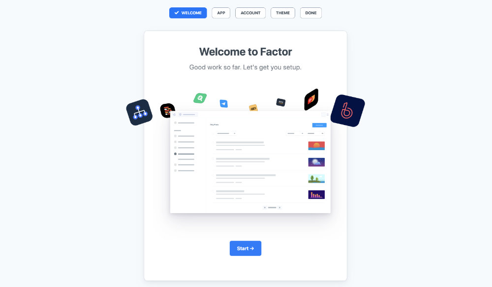
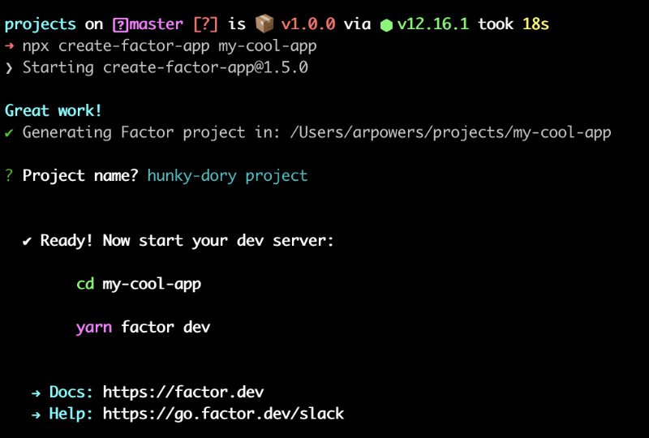

# QuickStart

Ready to Factor enable your JavaScript app? Alright let's do this...

> **Before You Start** Make sure you are running LTS NodeJS. Currently version 12 or newer.

## Approach 1 - Adding Factor Dependency

First, you should know that adding Factor is the same as adding any other dependency to a JS/Node project. All you have to do is add it as a dependency inside a standard `package.json` in your project.

```bash
npm install @factor/core
```

Once added your `package.json` should look something like this:

```json
{
  "name": "your project name",
  // other stuff
  "dependencies": {
    "@factor/core": "^1.0.0"
  }
}
```

### Start Development Server

Now that you have the Factor core package added, just run:

```bash
npx factor dev
```

This should kick off an installation and setup routine and guide you through the next steps.



Once this setup routine is finished, it will add some additional information to your `package.json` such as the name of your app, primary app email, production URL, etc..

## Approach 2 - Scaffold a Project with `create-factor-app`

If you'd like to setup a Factor project with recommended defaults and standard files, we also recommend using `create-factor-app` a special scaffolding tool we've made to help you with this.

To run this tool, just type the following (yes, it "just works" nothing else is necessary)

```bash
npx create-factor-app <folder-name>
```

or with Yarn:

```bash
yarn create factor-app <folder-name>
```

Once launched, this will kick up a CLI and walk you through the next steps.



Now, you should have a pre-scaffolded Factor project. All you need to do from here is run your development server.

```sh
npx factor dev
```

## Customizing Your App

Now that you have your app setup, the next thing to learn about is how to customize. There are three primary things to learn:

1. How to install and use plugins and/or themes
1. How to customize functionality with `factor-settings`
1. How to customize style with `factor-styles` and CSS variables
