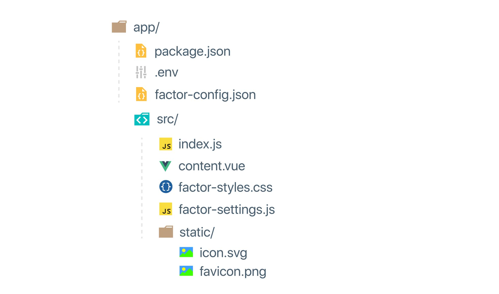

# App Structure

## Organizing Your App

The basic structure of Factor apps should be familiar to most Javascript developers.



Let's go through each of these files and what the do:

## Package Info

### package.json

This file is used to describe your application as an NPM package. Inside this file you should add:

```json
{
  "name": "myApp",
  "factor": {
    "load": "app"
  },
  "dependencies": {
    "@factor/core: ...
  }
}
```

## Public Config

### factor-config.json

Here you will store publicly accessible keys and information to configure your app. The `factor setup` command also writes configuration settings to this file. It also supports some overriding based on the environment that is running.

```json
{
  "myKey": "foo", // default myKey value
  "development": {
    "myKey": "bar" // value of myKey if NODE_ENV == development
  },
  "test": {
    "myKey": "baz" // value of myKey if FACTOR_ENV == test
  }
}
```

## Private Keys

### .env (dotenv)

For private configuration keys and information, Factor uses the standard [dotenv](https://github.com/motdotla/dotenv) library. This utility takes the values in this files and adds them to `process.env` at runtime. You should never commit this file to source control, treat it like a password.

```git
TOKEN_SECRET="SOME-LONG-TEXT-12345"
DB_CONNECTION="https://my-connection-string-etc"
```

## Source

### Root vs `src` folder

You can place code for you application in either the root of the directory or in a `src` folder. What determines this is the `main` value in your `package.json`. If the main value is in a subfolder, it is assumed this is where your source is.

### App Code Starts Here

The "main" file, typically `index.js`, is the entry point for applications business code. In this file you will add routes and other customization to get exactly what you want.

```js
import { addFilter, setting } from "@factor/api"

addFilter("content-routes", routes => {

  // add or customize routes

  return routes
}
```

You can control how exactly this file gets loaded via the `package.json > factor > load` attribute. For example you can break out the entry for the app vs the server as follows:

```json
// package.json
{
  "factor": {
    "load": {
      "app": "index", // Loads index.js in webpack app
      "server": "server" // Loads server.js in cli and express server
    }
  }
}
```

In the above case, Factor will load your app's `index.js` in the app environment (webpack) and run `server.js` in your server environment (config, endpoints, cli). This helps you cleanly separate server side code, e.g. endpoints and admin, from application specific code.

## Content Wrapper

### content.vue

This is the primary wrapper for the front-end content in your application, i.e. for everything besides your admin and dashboard.

It is designed to wrap your content, and allow you to add global UI elements like your navigation and footer.

Add `content.vue` to the root of your source code directory and Factor will auto-detect it.

## App Settings

### factor-settings.js

Factor has a powerfully simple settings system that works via `factor-settings` files found in your application as well as any plugins you have installed. It works by allowing you to easily override values from themes and plugins by placing values under the same key in your app.

## App Styles

### factor-styles.less, factor-styles.css, factor-styles.scss

Factor has a standardized global CSS styling system that works with a file called `factor-styles`. By default, this works with `.less` and `.css`, but it is possible to support additional formats like SASS and Stylus via plugins.

## Static Assets

### static/

Place a folder named `static` in your application `src` directory and it will be handled as the static assets for your app. All files in this folder will be copied to your `dist` folder at build-time and then served under their original name.

For example, an image under `static/my-image.jpg` will be available and served at `https://your-url.com/my-image.jpg` after build.

### icon.svg, favicon.png

Set the default icons by adding the `icon.svg` and `favicon.png` images to your static folder. They both should be square and ideally 100px by 100px.

## Generated Folders

### dist/, .factor/

Their are two folders that are generated and managed by Factor when you perform various operations.

- `dist/` this is your distribution application that is generated by Webpack. It is what is hosted and optimized for serving in production.
- `.factor/` this is where generated files and information are stored by Factor.
