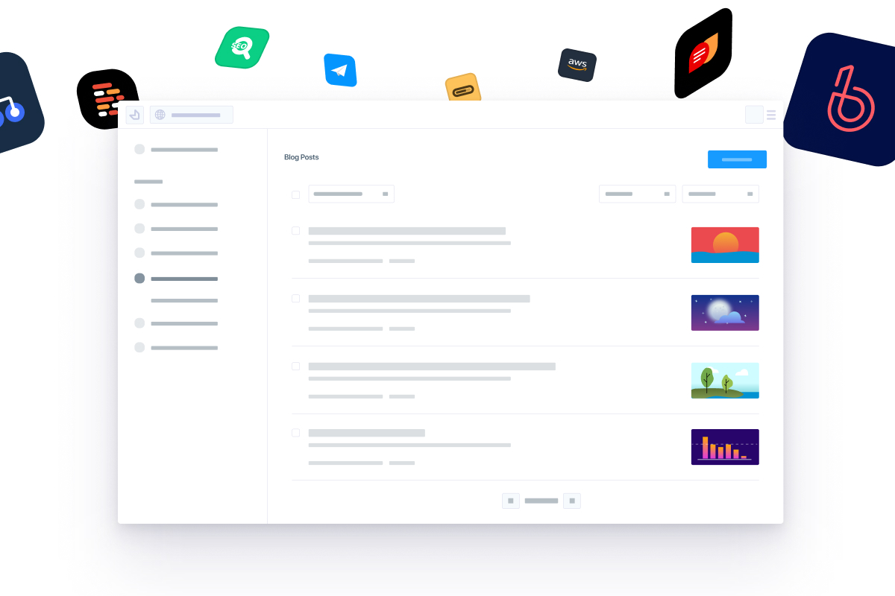

# Introduction

Factor is an open-source JavaScript platform built for web professionals. It is designed for people who care about quality and don't like limitations. It's also  nice for teams who need power and flexibility but have deadlines.

Hitting the right balance of needs has led Factor to be used in production by many organizations. Once you learn the basics, you'll love how easy it is to create superior websites and apps.

Every day Factor powers some of the most powerful yet scalable apps on the internet. It's modern architecture allows for portability, performance, and optimization which allows you to do more.

## The Problem Factor Solves

Building top-quality JavaScript apps is hard because there is too much reinventing of the wheel. Developers are forced to adopt too much code and things become complicated and brittle quickly. Months can be wasted developing, testing, and debugging code for boilerplate functionality that doesn't add distinct value to your app.

The solution to this problem is to use a core framework to help you with best practices and structure; and then add or develop plugins to reach mission specific goals.

## How Factor Is Different

The first question people usually ask is, how is Factor different from everything else out there?

A few key characteristics of Factor:

- **Easy Plugins and Themes** - Factor uses a special architecture that allows plugins and themes to 'just work.' Add a plugin and then customize, no integration steps.
- **No Functional Limitations** - A full stack system means power and simplicity. No more APIs or serverless functions for everything.
- **Javascript Only** - Build only with Javascript and Javascript friendly tech (JSON, Mongo, Typescript).
- **Modern Portability and Scalability** - Do things that your friends building PHP apps can only dream of...
- **Best Practices** - Built on non-biased open-source tech from developers just like us: Vue, Mongo, Node, Express.

Here is a comparison table to help you quickly see how things compare:

<table class="features-comparison">
  <thead>
    <tr>
      <th></th>
      <th>Factor <small style="text-transform:initial;color:#777;font-weight:400">(JavaScript CMS)</small></th>
      <th>PHP CMS <small style="text-transform:initial;color:#777;font-weight:400">(eg. WordPress)</small></th>
      <th>JAMStack <small style="text-transform:initial;color:#777;font-weight:400">(eg. Gatsby)</small></th> 
      <th>Frameworks <small style="text-transform:initial;color:#777;font-weight:400">(eg. Nuxt, Next)</small></th> 
    </tr>
  </thead>
  <tbody>
    <tr>
      <td><i>1️⃣</i> Single Language</td>
      <td>✅</td>
      <td>❌</td>
      <td>❓</td>
      <td>❓</td>
    </tr>
    <tr>
      <td><i>🚀</i> Modern Stack</td>
      <td>✅</td>
      <td>❌</td>
      <td>✅</td>
      <td>✅</td>
    </tr>
    <tr>
      <td><i>🎛</i> Dashboard &amp; CMS</td>
      <td>✅</td>
      <td>✅</td>
      <td>❌</td>
      <td>❌</td>
    </tr>
    <tr>
      <td><i>🔌</i> Easy to Extend</td>
      <td>✅</td>
      <td>✅</td>
      <td>❌</td>
      <td>❌</td>
    </tr>
    <tr>
      <td><i>🎨</i> Usable Themes</td>
      <td>✅</td>
      <td>✅</td>
      <td>❌</td>
      <td>❌</td>
    </tr>
    <tr>
      <td><i>🏎</i> Rapid Development</td>
      <td>✅</td>
      <td>❌</td>
      <td>✅</td>
      <td>❌</td>
    </tr>
    <tr>
      <td><i>⚡️</i> Dynamic (e.g. Auth)</td>
      <td>✅</td>
      <td>✅</td>
      <td>❌</td>
      <td>✅</td>
    </tr>
    <tr>
      <td><i>📈</i> Easily Scalable</td>
      <td>✅</td>
      <td>❌</td>
      <td>✅</td>
      <td>✅</td>
    </tr>
    <tr>
      <td><i>💼</i> Unified Platform</td>
      <td>✅</td>
      <td>✅</td>
      <td>❌</td>
      <td>❌</td>
    </tr>
  </tbody>
</table>

## Other Important Information

If you're considering Factor, then you'll probably want to know a bit about the philosophy and approach behind the software.

### Built by Fiction

Factor was created as an internal framework for building our own apps at [Fiction.com](https://www.fiction.com).

We started in 2017, building an application for renting monthly homes. In this process, we made MANY mistakes around new technology; continually getting fooled by the large marketing budgets of big corporations or venture funded companies.

After wasting many months reading technical documentation, debugging, reinventing the wheel, and discovering undisclosed limitations of proprietary services; we decided we needed to formalize our software approach and build something simple and standard, based on the best philosophical ideas from the last 50 years of software development.

With that, we started building Factor.

### Software Philosophy

The detailed picture is covered in the core concepts document, but here are some key "rules" we follow to deliver a superior product:

- **Build on an Open-Source Stack.** Working with proprietary technology often leads to risks and costs in the long term. We've found that open-source tech is not only free, but also reduces risk and encourages standardization of your app.

- **80% Rule of Core vs Extension.** Most features belong in an extension; this allows us to keep Factor core light while allowing users to "choose their own adventure" regarding which features they'd like to have (via plugins and themes). The rule is that any core feature must be needed or useful to at least 80% of the user base.

- **The 12 Factor App** The [12 Factor App](https://12factor.net/) guideline discusses how to build apps that are scalable and portable; also, easy to develop. Factor leverages this philosophy.

- **JavaScript and TypeScript Only** In the last years, the one language that has made the most progress is clearly JavaScript and it's type-safe buddy TypeScript. For that reason, Factor is focused on JS and JS oriented libraries. That way you only need to learn one key language and complementary tools.
